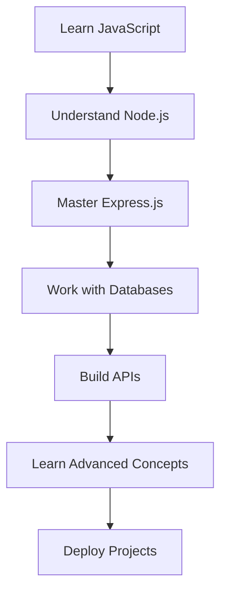

# JavaScript Backend Development Roadmap

### Summary
This document lays out a step-by-step roadmap for mastering JavaScript backend development, based on insights and strategies from the video "Chai aur Backend." It focuses on foundational concepts, tools, and best practices to build a career in backend development.

---

## Table of Contents
1. [Introduction to Backend Development](#introduction-to-backend-development)
2. [Core Backend Skills](#core-backend-skills)
3. [Key Tools and Technologies](#key-tools-and-technologies)
4. [Setting Up Projects](#setting-up-projects)
5. [Working with Databases](#working-with-databases)
6. [APIs and Authentication](#apis-and-authentication)
7. [Advanced Concepts](#advanced-concepts)
8. [Best Practices and Tips](#best-practices-and-tips)

---

## Introduction to Backend Development
**Timestamp: 00:03**
- **Definition**: Backend development refers to server-side programming that powers the logic, databases, and APIs behind web applications.
- **Why JavaScript?**
  - Single language across the stack (Node.js for backend).
  - High demand in the job market.

### Key Backend Responsibilities:
1. Handling server-side logic.
2. Managing databases.
3. Implementing APIs and authentication.
4. Ensuring security and performance.

---

## Core Backend Skills
**Timestamp: 02:14**
### Programming Skills:
- Learn JavaScript deeply (e.g., closures, promises, async/await).
- Understand TypeScript for scalable projects.

### Concepts:
- HTTP and RESTful APIs.
- Asynchronous programming.
- Error handling and debugging.

---

## Key Tools and Technologies
**Timestamp: 06:00**
- **Node.js**: The runtime for JavaScript backend.
- **Express.js**: A lightweight framework for building APIs.
- **Database Systems**:
  - NoSQL: MongoDB.
  - SQL: PostgreSQL, MySQL.
- **Package Managers**: npm or yarn.

---

## Setting Up Projects
**Timestamp: 09:32**
### Steps:
1. Initialize a Node.js project:
   ```bash
   npm init -y
   ```
2. Install dependencies:
   ```bash
   npm install express mongoose dotenv
   ```
3. Set up folder structure:
   ```
   project/
   ├── controllers/
   ├── models/
   ├── routes/
   ├── middlewares/
   ├── .env
   ├── server.js
   ├── package.json
   ```

---

## Working with Databases
**Timestamp: 14:15**
### NoSQL (MongoDB):
- Install MongoDB and Mongoose.
- Connect to MongoDB:
  ```js
  const mongoose = require('mongoose');
  mongoose.connect(process.env.DB_URI, { useNewUrlParser: true, useUnifiedTopology: true });
  ```

### SQL (PostgreSQL):
- Install pg library for Node.js.
- Basic query example:
  ```js
  const { Client } = require('pg');
  const client = new Client({ connectionString: process.env.DATABASE_URL });
  client.connect();
  ```

---

## APIs and Authentication
**Timestamp: 18:29**
### Building APIs:
- Define routes using Express:
  ```js
  const express = require('express');
  const app = express();

  app.get('/api/data', (req, res) => {
    res.json({ message: 'Hello World!' });
  });

  app.listen(3000, () => console.log('Server running on port 3000'));
  ```

### Authentication:
- Use JSON Web Tokens (JWT):
  ```bash
  npm install jsonwebtoken bcrypt
  ```
- Example middleware for verifying JWT:
  ```js
  const jwt = require('jsonwebtoken');
  
  const authenticateToken = (req, res, next) => {
    const token = req.header('Authorization');
    if (!token) return res.status(401).send('Access Denied');

    try {
      const verified = jwt.verify(token, process.env.JWT_SECRET);
      req.user = verified;
      next();
    } catch (err) {
      res.status(400).send('Invalid Token');
    }
  };
  ```

---

## Advanced Concepts
**Timestamp: 22:45**
- **Scalability:**
  - Implement load balancing and clustering with tools like PM2.
- **Caching:**
  - Use Redis for faster data access.
- **WebSockets:**
  - Real-time communication using `socket.io`.

---

## Best Practices and Tips
**Timestamp: 28:32**
1. Use environment variables for sensitive data.
2. Modularize code for better readability and maintainability.
3. Write unit tests for critical features.
4. Document APIs using tools like Swagger or Postman.
5. Stay updated with new JavaScript features and backend trends.

---

## Visual Overview
### Roadmap:


---

This roadmap serves as a beginner-friendly guide to becoming a proficient JavaScript backend developer. Let me know if you need more details or visualizations!

