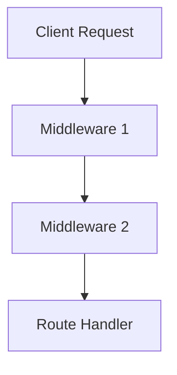

# Professional Backend Project Setup

### Summary
This document provides a comprehensive guide to setting up a professional-grade backend project, focusing on essential practices like securing user data, managing environment variables, and utilizing version control systems effectively. Visual aids, structure trees, and tips for best practices are included to make the process beginner-friendly and actionable.

---

## Table of Contents
1. [Professional Journey Begins](#professional-journey-begins)
2. [Setting Up the Project](#setting-up-the-project)
3. [Version Control with Git](#version-control-with-git)
4. [Managing Environment Variables](#managing-environment-variables)
5. [Using Node Mon](#using-node-mon)
6. [Understanding Middlewares](#understanding-middlewares)
7. [Project Structure Overview](#project-structure-overview)
8. [Sharing and Teaching](#sharing-and-teaching)

---

## Professional Journey Begins
**Timestamp: 00:03**
- The journey of building a production-grade backend begins here.
- Focus is on creating a scalable, secure, and maintainable system.
- Importance of structured planning and coding standards.

---

## Setting Up the Project
**Timestamps: 02:14, 06:00, 07:54**
- Install essential tools (Node.js, npm, database clients).
- Create a new project directory.
- **Securing User Data:**
  - Use hashed passwords (e.g., bcrypt).
  - Limit access to sensitive data.
- **Handling Images:**
  - Store images in dedicated directories or cloud storage.
  - Use middleware like Multer for uploads.

---

## Version Control with Git
**Timestamps: 12:01, 14:31, 18:29**
- Initialize a Git repository using `git init`.
- Set the main branch as the default:
  ```bash
  git branch -M main
  git remote add origin <repository-url>
  git push -u origin main
  ```
- **Create a .gitignore File:**
  - Exclude sensitive files like `.env` and `node_modules`:
    ```
    node_modules/
    .env
    .DS_Store
    ```

---

## Managing Environment Variables
**Timestamp: 20:18**
- Store sensitive data (e.g., API keys, database URIs) in a `.env` file.
- Use the `dotenv` library to load environment variables into your project.
- Example:
  ```js
  require('dotenv').config();
  const dbURI = process.env.DB_URI;
  ```

---

## Using Node Mon
**Timestamps: 24:01, 25:44**
- Install `nodemon` to automatically restart the server during development:
  ```bash
  npm install --save-dev nodemon
  ```
- Update `package.json` to include:
  ```json
  "scripts": {
    "start": "node server.js",
    "dev": "nodemon server.js"
  }
  ```

---

## Understanding Middlewares
**Timestamp: 29:16**
- Middlewares are functions that execute during the request-response cycle.
- Example:
  ```js
  app.use((req, res, next) => {
    console.log(`Request Method: ${req.method}, URL: ${req.url}`);
    next();
  });
  ```
- Use cases:
  - Authentication
  - Error handling
  - Logging

---

## Project Structure Overview
**Timestamps: 31:11, 34:34, 36:17, 39:32**
- **Structure Tree:**
  ```
  project-folder/
  ├── controllers/
  ├── models/
  ├── routes/
  ├── middlewares/
  ├── public/
  │   ├── images/
  │   ├── css/
  ├── .env
  ├── server.js
  ├── package.json
  ├── README.md
  ```
- **Best Practices:**
  - Modularize code into folders.
  - Keep route logic in separate files.

---

## Sharing and Teaching
**Timestamp: 41:10**
- Sharing knowledge reinforces learning.
- Document processes and create guides for team members.
- Utilize platforms like GitHub to host and share code.

---

## Visual Elements
### Sample Middleware Flow Diagram:


---

This document serves as a structured, beginner-friendly guide for setting up a professional backend project. Let me know if you need further customizations or additions!

